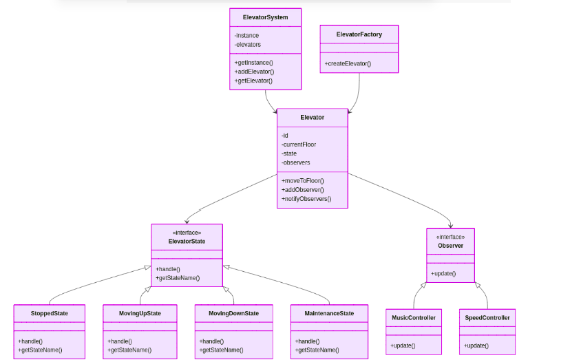

=== DEMONSTRAÇÃO DA INTELIGÊNCIA DO SISTEMA ===

Sistema de Elevadores inicializado (Singleton)
Elevador E001 criado no andar 1
Factory: Elevador padrão E001 criado
Elevador E002 criado no andar 1
Factory: Elevador padrão E002 criado
Elevador E003 criado no andar 1
Factory: Elevador padrão E003 criado
Elevador E001 adicionado ao sistema
Observer MusicController adicionado ao elevador E001
Observer SpeedController adicionado ao elevador E001
Elevador E002 adicionado ao sistema
Observer MusicController adicionado ao elevador E002
Observer SpeedController adicionado ao elevador E002
Elevador E003 adicionado ao sistema
Observer MusicController adicionado ao elevador E003
Observer SpeedController adicionado ao elevador E003
1. OPERAÇÃO NORMAL - SEM MÚSICA
Elevador E001 recebeu solicitação para andar 5
Elevador E001 iniciando subida
Elevador E001: Estado alterado de 'Parado' para 'Subindo'
Elevador E001 subindo do andar 1 para 5
Elevador E001: Estado alterado de 'Subindo' para 'Parado'
Elevador E002 recebeu solicitação para andar 3
Elevador E002 iniciando subida
Elevador E002: Estado alterado de 'Parado' para 'Subindo'
Elevador E002 subindo do andar 1 para 3
Elevador E002: Estado alterado de 'Subindo' para 'Parado'

2. SITUAÇÃO DE PANE/MANUTENÇÃO - INTELIGÊNCIA ATIVADA
Elevador E002: Estado alterado de 'Parado' para 'Manutenção'
Reproduzindo música de manutenção Música relaxante tocando.. - Aguarde, voltaremos em breve no elevador E002
Motivo: Elevador em pane - tranquilizando usuários
Analisando impacto da manutenção do elevador E002
Velocidade reduzida para 60% nos elevadores operacionais
Apenas 2 elevadores disponíveis

3. SITUAÇÃO DE SOBRECARGA - DECISÕES INTELIGENTES
SOBRECARGA detectada no elevador E001: 1200kg > 1000kg
Reproduzindo Anúncio: Por favor, redistribuam o peso no elevador E001
Detectada sobrecarga no elevador E001
Otimizando velocidade dos 2 elevadores disponíveis
Velocidade ajustada para 70% para absorver demanda extra

4. SITUAÇÃO DE EMERGÊNCIA - PROTOCOLOS AUTOMÁTICOS
EMERGÊNCIA detectada no elevador E003: incêndio
Reproduzindo Anúncio: Mantenha a calma - Socorro a caminho no elevador E003
Ativando protocolo de emergência
Todos os elevadores em velocidade de segurança: 40%
Protocolo de segurança em emergências

5. FALHA DE ENERGIA - MODO ECONOMIA AUTOMÁTICO
FALHA DE ENERGIA detectada no elevador E001
Reproduzindo Anúncio: Energia sendo restaurada no elevador E001
Ativando modo economia de energia
Velocidade reduzida para 80% em todos os elevadores

6. RETORNO AO NORMAL - SISTEMA SE ADAPTA
Elevador E003 recebeu solicitação para andar 2
Elevador E003 iniciando subida
Elevador E003: Estado alterado de 'Parado' para 'Subindo'
Elevador E003 subindo do andar 1 para 2
Música interrompida no elevador E003 - operação normalizada
Elevador E003: Estado alterado de 'Subindo' para 'Parado'caminho/para/imagem.jpg

Rodando com o Decorator: Resultado

Elevador E004 criado no andar 1
Elevador E004 recebeu solicitação para andar 7
Elevador E004 iniciando subida
Elevador E004: Estado alterado de 'Parado' para 'Subindo'
Elevador E004 subindo do andar 1 para 7
Elevador E004: Estado alterado de 'Subindo' para 'Parado'
[Monitor] Mostrando no display: Andar 7
[Voz] Anunciando: Chegando ao andar 7
[Decoração] Elevador decorado para: Natal
{'id': 'E004', 'current_floor': 7, 'state': 'Parado', 'decoration': 'Natal'}
